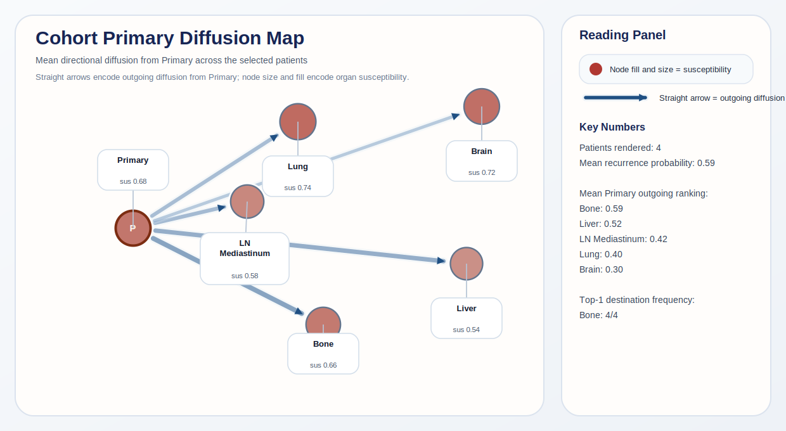
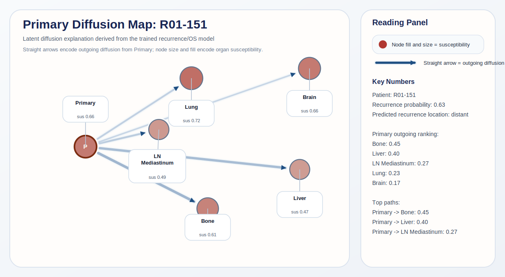
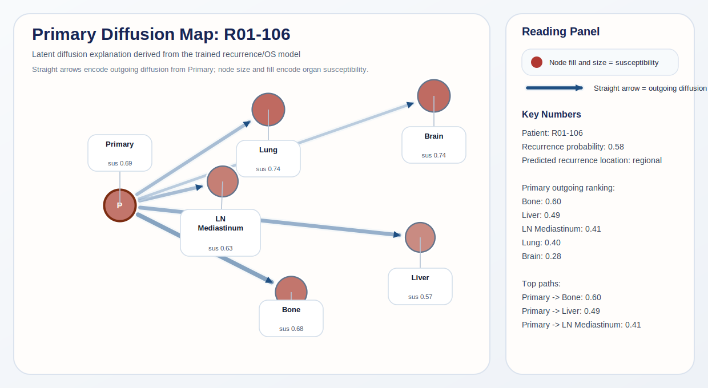
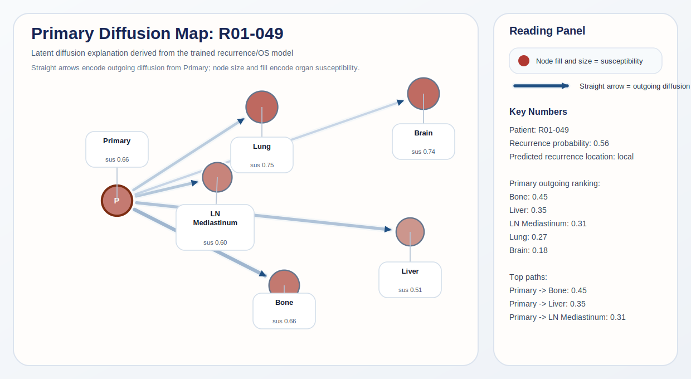
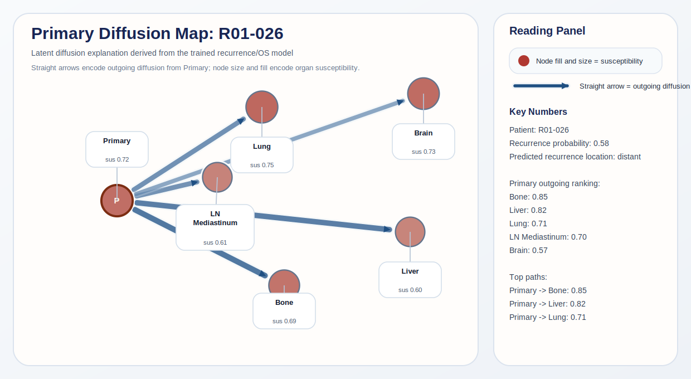

# Multimodal Graph Reasoning for Implicit Metastasis Pathway Inference and Survival Prediction

## Intro

This project was originally conceived as my capstone project, but I ended up building it as a final project for this course instead. In this project, I built a multimodal prediction pipeline for non-small cell lung cancer (NSCLC) using two public datasets: the NSCLC Radiogenomics cohort as the primary patient-level source of CT, RNA, clinical, and outcome data, and CT-ORG as the auxiliary dataset for organ segmentation and anatomical alignment. The system had three explicit goals: predicting overall survival (OS), predicting recurrence and its location, and producing structured organ-level diffusion paths as an explanation of how the model distributes latent metastatic spread tendency. Traditional clinical models often focus on one modality only, such as imaging or tabular clinical variables, and they usually provide limited insight into how risk may be distributed across organs. I wanted to design a system that could integrate CT imaging, clinical information, RNA expression, and immune-related signals into a single framework while still producing outputs that are clinically meaningful across all three goals.

For OS, I used a Cox-based survival head trained on time-to-event labels. For recurrence, I trained a classification head that jointly predicts whether recurrence occurs and, when location labels are available, distinguishes local, regional, and distant patterns. For diffusion paths, I introduced an organ diffusion explanation layer built on top of the graph reasoning module: it produces per-organ susceptibility scores, edge-level diffusion probabilities, and ranked top-k organ-to-organ paths extracted by beam search. This distinction is important: the diffusion outputs are not direct organ-level ground truth labels, because the public cohort does not provide reliable metastatic path supervision. Instead, they act as model-guided explanations constrained by the primary survival and recurrence tasks.

## Workflow

1. I constructed a patient manifest and time-zero labels for 211 patients.
2. I preprocessed CT data, matched tumor segmentation, and trained or applied the organ segmentation model.
3. I generated RNA, immune, and EHR embeddings for the patients with available data.
4. I assembled all modality outputs into organ-level tokens, fused them, and performed graph-based reasoning.
5. I trained the model in phases, beginning with a larger non-RNA baseline and then fine-tuning on the smaller RNA subset.
6. I exported both quantitative outputs and visual diffusion reports, and I also verified that the pipeline can run an external-case inference smoke test.

## Method

**System Overview.** I implemented a multimodal machine learning pipeline to predict patient overall survival (OS) and infer cancer metastasis pathways. The pipeline takes three types of data: CT scans, RNA expression profiles, and clinical tabular data (EHR). It processes these inputs, fuses them into specific anatomical "organ nodes," passes them through a graph network to simulate cancer spread, and finally outputs a survival risk score along with a predicted metastasis path.

*Figure 1. Academic overview of the implemented architecture. Multimodal evidence tokens are fused into organ embeddings by a Transformer-style cross-attention block, refined by a prior-constrained graph reasoning module, and finally passed into a jointly supervised prediction stage for survival, recurrence, location, and latent pathway explanation. In the current implementation, Stage 10 and Stage 11.2 are frozen reservoir-style transforms, while the downstream joint prediction block is trainable.*

**Feature Extraction and Fusion.** I used dedicated encoders to extract features from the raw data: 3D CNNs for CT images, MLPs for RNA embeddings, and tabular encoders for the clinical records. A major challenge in the combined data pipeline was missing modality coverage in the Radiogenomics cohort (e.g., many patients lacked bone CT scans). To solve this, I defined a fixed set of six logical "organ queries" (Primary Tumor, Lung, Bone, Liver, Lymph Node, and Brain). I used a Cross-Attention module to fuse the data: the organ queries attend to the available evidence tokens. If a specific CT scan is missing, the cross-attention mechanism naturally allows that organ query to gather relevant risk information from the global RNA or clinical data instead, avoiding the need for manual data imputation.

**Graph Reasoning and Reservoir Computing.** After fusion, the six organ tokens ($Z$) are passed into a Graph Transformer to model how cancer cells might spread between organs. I incorporated basic medical knowledge into the graph by initializing the edges with clinical priors (e.g., stronger connections from the primary tumor to lymph nodes). Crucially, because my dataset is relatively small (211 patients in total), training the entire Cross-Attention and Graph Transformer modules end-to-end would inevitably lead to severe overfitting. To solve this, I drew inspiration from the principles of Reservoir Computing and Extreme Learning Machines (ELM). Instead of updating the millions of parameters in these transformer modules, I froze them with their random initializations. In this paradigm, the cross-attention and graph networks act as a fixed, high-dimensional "reservoir." They non-linearly mix the multimodal features and project them into a complex topological space, allowing the downstream model to learn the survival patterns without the risk of parameter bloat.

**Joint Prediction and Latent Supervision.** Only the final prediction layers (the Explanation-Guided Primary Model, consisting of several MLPs) were trained using gradient descent. Instead of treating the metastasis pathway prediction as an afterthought, I integrated it into the main loop. The graph outputs ($Z'$) are used to calculate organ susceptibility and edge probabilities. Since I do not have ground-truth labels for the exact metastasis pathways, I used the patient's actual survival time as the primary training signal via Cox Proportional Hazards loss. By optimizing the survival prediction, the model is forced to adjust its internal pathway probabilities to logically explain the survival outcome. This allows the model to output a clinically meaningful metastasis graph without requiring explicit pathway labels.

## Results

### Quantitative Performance

The full cohort contains 211 patients. CT was available for all 211 cases, PET for 201, tumor segmentation for 144, AIM semantic annotations for 190, and RNA for 130. This distribution already explains one of the core challenges of the project: the richest multimodal setting is also the smallest one.

| Experiment | Cohort | C-index | Rec AUC | Loc Acc | Expl Rec AUC | Expl Loc Acc |
|---|---|---:|---:|---:|---:|---:|
| Stage 12 CV baseline | 211 | 0.531 | 0.567 | 0.377 | — | — |
| Phase 3 (no RNA) | 211 | 0.642 | 0.675 | 0.462 | 0.603 | 0.538 |
| Phase 4 initial | 130 | 0.534 | 0.526 | 0.444 | — | — |
| Phase 4 best tuned | 130 | 0.511 | 0.696 | 0.333 | 0.503 | 0.556 |

These numbers show a clear pattern. The strongest survival-oriented validation result came from the Phase 3 baseline trained on the larger 211-patient cohort without RNA. However, after tuning, the Phase 4 RNA-based model achieved the best recurrence discrimination, reaching a recurrence AUC of 0.696. This suggests that RNA information can improve recurrence modeling, but only after careful tuning, and that the small size of the RNA subset still limits stability for survival and location prediction. The explanation head outputs (Expl Rec AUC and Expl Loc Acc) are auxiliary signals produced by the diffusion layer rather than the primary prediction heads; they are included here for completeness and show broadly consistent but non-identical trends to the primary heads.

### Tuning Stability

Phase 4 tuning proceeded in three stages. Stage A searched over freeze strategies (pool-only vs. pool+base_trunk), Stage B refined loss weights (λ_expl_loc and λ_edge_prior), and Stage C tested seed robustness. The best configuration used freeze pool+base_trunk, lr=1e-4, λ_expl_loc=0.25, and λ_edge_prior=0.05. Across the three seeds tested in Stage C, recurrence AUC varied substantially: seed 2024 gave 0.567, seed 2025 gave 0.696, and seed 2026 gave 0.462, with a cross-seed mean of 0.575. This high variance across seeds confirms that the small size of the RNA subset (N=130) introduces meaningful stochastic instability, and the reported best result should be interpreted in that context.

### Diffusion Pattern Comparison

The diffusion explanation outputs changed substantially between Phase 3 and the best Phase 4 run. The table below summarizes the key contrasts:

| | Phase 3 (N=211) | Phase 4 best (N=130) |
|---|---|---|
| Dominant top-1 path | Primary → Liver (100%) | Primary → Bone (97.7%) |
| Top organ susceptibility | Primary (0.246) | Lung (0.751) |
| Susceptibility range | 0.0003 – 0.780 | 0.345 – 0.837 |
| Highest mean edge | Lymph→Primary (0.997) | Lymph→Primary (0.750) |

The shift in dominant top path from Liver to Bone between phases is directly attributable to the addition of RNA signal. In Phase 3, the no-RNA model produces a sparse susceptibility distribution — most organs are near-zero, with elevated weight only at the primary site — suggesting the model collapses its explanation onto the primary tumor in the absence of systemic signal. In Phase 4, susceptibility is compressed and more uniformly distributed (all organs fall between 0.35 and 0.84), consistent with RNA capturing systemic rather than purely local disease signals and spreading latent risk allocation across the organ graph.

At the cohort level, mean outgoing edge probabilities from the primary node rank as follows: Primary→Bone (0.590) > Primary→Liver (0.538) > Primary→Lymph (0.430) > Primary→Lung (0.428) > Primary→Brain (0.333). This ordering mirrors known NSCLC distant metastasis prevalence, where bone and liver are the leading distant sites, lending face validity to the learned latent explanation despite the absence of explicit pathway supervision.

I interpret all diffusion outputs as model-internal risk allocation patterns rather than biological truth claims.

### Visual Results

The cohort-level visualization below summarizes the dominant diffusion structure learned by the best tuned model.

*Figure 1. Cohort-level diffusion summary for the best tuned model. It highlights the dominant organ-to-organ explanation pattern across the RNA subset, with bone emerging as the main destination in the latent diffusion layer.*

To make the results more concrete, I also include representative patient-level figures from the generated visualization set.

*Figure 2. Patient `R01-151` is a high-risk distant-recurrence example with strong bone and liver diffusion tendencies, making it a useful illustration of the model's high-confidence explanation behavior.*

*Figure 3. Patient `R01-106` was predicted as a regional case, showing that the model can produce a different recurrence-location prediction while still maintaining a structured organ diffusion pattern.*

*Figure 4. Patient `R01-049` was predicted as a local case. I include it because it shows that the latent path ranking and the supervised recurrence-location label are related but not identical.*

*Figure 5. Patient `R01-026` is a strong bone-dominant example with very high top-path probabilities, making it a representative high-separation case for qualitative inspection.*

Beyond the training results, I also confirmed that the system can generate an external-case inference report in HTML. This means the project is not only a modeling experiment, but also a deployable reporting prototype.

## Conclusion

Overall, this project demonstrates that a multimodal NSCLC pipeline can jointly support prediction and structured explanation. I successfully integrated imaging, clinical, RNA, and immune features into an organ-level architecture with graph reasoning, and I produced both quantitative outputs and visual reports. The results indicate that the larger non-RNA baseline remains more stable for survival modeling, while the tuned RNA-based model offers the strongest recurrence discrimination. This means multimodal learning is promising, but it requires careful tuning and is still constrained by sample size.

The most important conclusion is that the framework is feasible and extensible. It already supports end-to-end processing, cohort-level visualization, patient-level diffusion figures, and external-case reporting. At the same time, the explanation layer should be interpreted carefully, because it provides latent task-guided structure rather than organ-level truth. In future work, stronger validation on larger multimodal cohorts would be necessary to confirm whether the learned diffusion patterns reflect clinically reliable biology.
